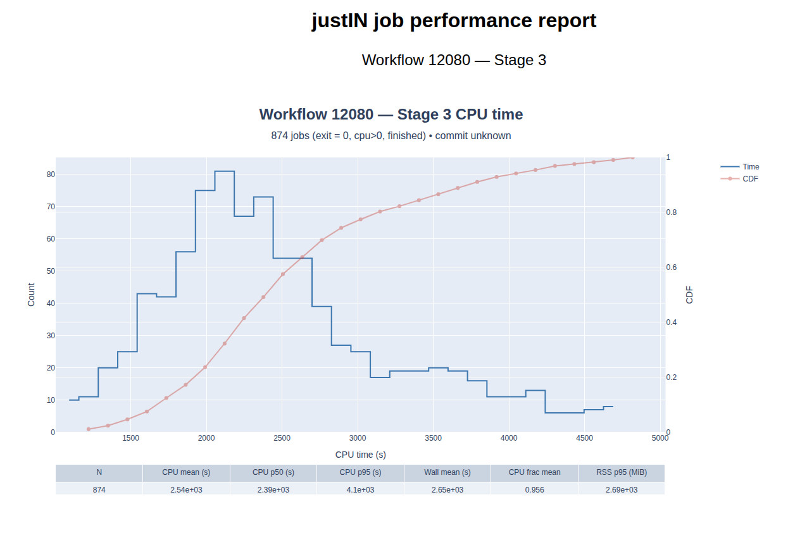

# dune-justin

This repository contains job scripts, workflow configuration, and submission utilities
for running DUNE Monte Carlo production workflows using **justIN**.  
It is primarily intended for **multi-stage LArSoft workflows** (GEN → G4 → DETSIM → RECO),
with optional LArCV outputs, and is designed to scale from small tests to large production
campaigns.

The repository is actively used for development, testing, and production runs on the
DUNE distributed computing infrastructure.

---

## Repository Structure (high level)

```
.
├── DUNESpineWorkshop2026/                 # This folder contains configuration files for workshop
	├── fhicl
    ├── atmospheric_nu_2hitSP_config.json  # Atmospheric neutrinos
    ├── mvpmpr_2hitSP.yaml                 # Meant to be example yaml file
    ├── mvpmpr_2hitSP_config.json          # Multi-particle vertex + "rain"
    ├── prodgenie_nu_2hitSP_config.json    # beam neutrinos
├── MCjobSubmission                        # This folder contains scripts for submitting workflow
│   ├── scripts to submit/run a workflow
├── Statistics                             # scripts for getting job statistics
	├── scripts to get job statistics
├── bundles/
│   └── fhicl_bundle.tgz                   # packaged FHiCL files
├── docs/                                  # For any live html pages we want to serve
    ├── Statistics/
        ├── justinPeformanceExample.html
├── testing                                # old, will be removed in future
└── README.md
```

---

## Creating a New Workflow

Workflows are typically created programmatically (recommended) using a configuration
file rather than manually assembling command-line calls.

### Basic steps

1. **Decide the workflow structure**
   - Number of stages (e.g. GEN → G4 → DETSIM → RECO)
   - Output products to keep (usually RECO and optional LArCV)
   - Events per job and total event count

2. **Create a workflow configuration file**
   - JSON format is used (YAML also supported if available)
   - Example fields include:
     - number of Monte Carlo jobs
     - job scripts per stage
     - FHiCL files
     - resource requests (walltime, memory)
     - output patterns and RSEs

3. **Run the submission script**
   ```bash
   python mcJobSubmission.py --config my_workflow_config.json
   ```

This will:
- create the workflow,
- define all stages,
- and submit the workflow to justIN.

---

## Running and Monitoring Workflows

### Submission
Once a workflow is created and submitted, justIN manages job execution automatically.

You can monitor progress via:

- **Web dashboard**  
  https://dunejustin.fnal.gov/dashboard

- **Command line**
  ```bash
  justin show-stages --workflow-id <WFID>
  justin show-jobs   --workflow-id <WFID>
  ```

For Condor-level debugging:
```bash
export GROUP=dune
condor_q -pool dunegpcoll01.fnal.gov -name dunegpschedd01.fnal.gov <cluster.proc>
```

---

## Job Outputs

- Intermediate stage outputs (GEN, G4, DETSIM) are typically short-lived
  and exist only to feed the next stage.
- Final outputs (RECO and optional LArCV ROOT files) are preserved and
  registered in Rucio/MetaCat.

Output locations can be queried with:
```bash
justin show-files --workflow-id <WFID>
justin show-replicas --file-did <DID>
```

---

## Generating Job Statistics

Job-level and workflow-level statistics can be extracted using:

- `justin show-jobs`
- Condor history (`condor_history`)
- Log parsing (CPU time, memory usage, wall time)

Typical statistics of interest:
- Success / failure rates per stage
- CPU and wall time distributions
- Memory usage
- Throughput (events/day)

Dedicated scripts for aggregating and plotting statistics are expected to evolve
as production usage grows.

In the meantime, one can "scrape" some information from the workflow job pages and 
use the script in the repository:
- First collect the information:
```bash
justin show-jobs --workflow-id wfid | awk '{print $1}' > jobids.txt
```
- Then use the jobStatistics.py file in the Statistics folder to make a pandas dataframe
- jobStatisticsDisplay.py is an example of how to display some useful informatin
- The following examples demonstrate post-processing of justIN workflows:
- CPU time (click on image for live GitHub Pages report):[](https://sfbaylaser.github.io/dune-justin/Statistics/justinPerformanceExample.html) Generated from workflow 12080, stage 3, exit=0, cpu>0 jobs only.
---

## Best Practices

- Use **moderate workflow sizes** rather than extremely large single workflows.
- Prefer **fewer stages** when intermediate outputs do not need to be preserved.
- Use short Rucio lifetimes for intermediate products.
- Test new job scripts with small MC counts before scaling up.

---

## To Do

- [ ] Add automated job statistics collection scripts
- [ ] Document recommended site/RSE selections
- [ ] Add example multi-step (combined) job scripts
- [ ] Improve error handling and restart guidance
- [ ] Provide example campaign-based production layouts
- [ ] Add CI checks for jobscript syntax
- [ ] Expand documentation for new users
- [ ] Understand and fix some of the lar related job failures

---

## Notes

This repository reflects active development and real production usage.
Interfaces, scripts, and conventions may evolve as justIN and DUNE computing
infrastructure change.

Feedback and contributions are welcome.


---

## Quick Start (10 minutes)

This section walks through creating and launching a minimal multi‑stage workflow end‑to‑end. Setting up justin follows the steps
described in the [justin tutorial](https://dunejustin.fnal.gov/docs/tutorials.dune.md). Note that if this is your first time using justin you will need to "authorize your computer" the 
first time (see the discussion in the justin tutorial).

1. **Log in to a DUNE GPVM node**
   ```bash
   ssh dunegpvmXX.fnal.gov
   ```
2. **Start an SL7 apptainer**
   ```bash
   /cvmfs/oasis.opensciencegrid.org/mis/apptainer/current/bin/apptainer shell --shell=/bin/bash -B /cvmfs,/exp,/nashome,/pnfs/dune,/opt,/run/user,/etc/hostname,/etc/hosts,/etc/krb5.conf --ipc --pid /cvmfs/singularity.opensciencegrid.org/fermilab/fnal-dev-sl7:latest
   ```

3. **Set up the DUNE + justIN environment**
   ```bash
   source /cvmfs/dune.opensciencegrid.org/products/dune/setup_dune.sh
   setup justin
   ```

4. **Clone a copy of this repository**
   ```bash
   cd /exp/dune/app/users/you/
   git clone https://github.com/SFBayLaser/dune-justin.git
   ```

5. **Prepare a workflow configuration**  
   Copy an existing JSON config (for example `configs/mpvmpr_2hitSP_config.json`) and adjust:
   - number of jobs / events
   - FHICL filenames
   - RSE and lifetimes

6. **Create and submit the workflow**
   ```bash
   python mcJobSubmission.py --config my_config.json
   ```

7. **Monitor progress**
   ```bash
   justin show-workflows
   justin show-stages --workflow-id <WFID>
   justin show-jobs   --workflow-id <WFID>
   ```

8. **Inspect outputs**  
   Use MetaCat or Rucio to locate final reco outputs:
   ```bash
   metacat file show <scope>:<filename>
   rucio replica list file <scope>:<filename>
   ```

You should be able to go from zero to running jobs in ~10 minutes once the environment is set up.

---

## Common Failure Modes & Fixes

### Workflow fails immediately with `WORKFLOW_FAILED_TOO_MANY_FILES`
**Cause:** Too many jobs/files in a single workflow (e.g. O(10k+) outputs).

**Fix:**
- Split production into multiple workflows under the same campaign
- Reduce jobs per workflow (e.g. 3–7k jobs per workflow)

---

### Files stuck in `Unallocated`
**Cause:** Downstream stage cannot allocate inputs (often site or memory constraints).

**Checks:**
```bash
justin show-jobs --workflow-id <WFID> --stage-id <N>
condor_q -better-analyze <cluster.proc>
```

**Fixes:**
- Relax `Desired_Sites`
- Lower `RequestMemory`
- Allow more output RSEs

---

### Jobs idle forever in HTCondor
**Cause:** No matching resources satisfy constraints.

**Fix:**
- Inspect `condor_q -better-analyze`
- Verify CVMFS requirements
- Reduce memory or disk requests

---

### GEN/G4/DETSIM runs but job marked failed
**Cause:** justIN bookkeeping failure (HTTP 500 during `record_results`).

**Notes:**
- Output files are usually *valid*
- Re-running the workflow or failing/restarting files is safe

---

### Rucio errors: `certificate expired`
**Cause:** Expired or missing X509 proxy.

**Fix:**
```bash
voms-proxy-init -rfc -voms dune -valid 96:00
export X509_USER_PROXY=/tmp/x509up_u$(id -u)
```

---

### FHICL files not found
**Cause:** `FHICL_FILE_PATH` not set or bundled files missing.

**Fix:**
- Bundle FHICL directory as `.tgz`
- Untar in jobscript
- Set:
```bash
export FHICL_FILE_PATH="$PWD/fhicl:${FHICL_FILE_PATH}"
```

---

## Production Scaling Notes

- **Prefer multiple medium workflows** over one massive workflow
- Keep GEN/G4/DETSIM lifetimes short (1–2 days)
- Only long‑term store RECO + analysis outputs
- Campaign IDs are cheap — use them

---

## Roadmap / To‑Do (Expanded)

- [ ] Campaign‑level submission helper
- [ ] Automatic workflow chunking for large productions
- [ ] Retry/auto‑fail logic for transient HTTP errors
- [ ] Integrated job efficiency dashboard
- [ ] Example configs for official DUNE geometries
- [ ] Documentation on MC unit accounting

